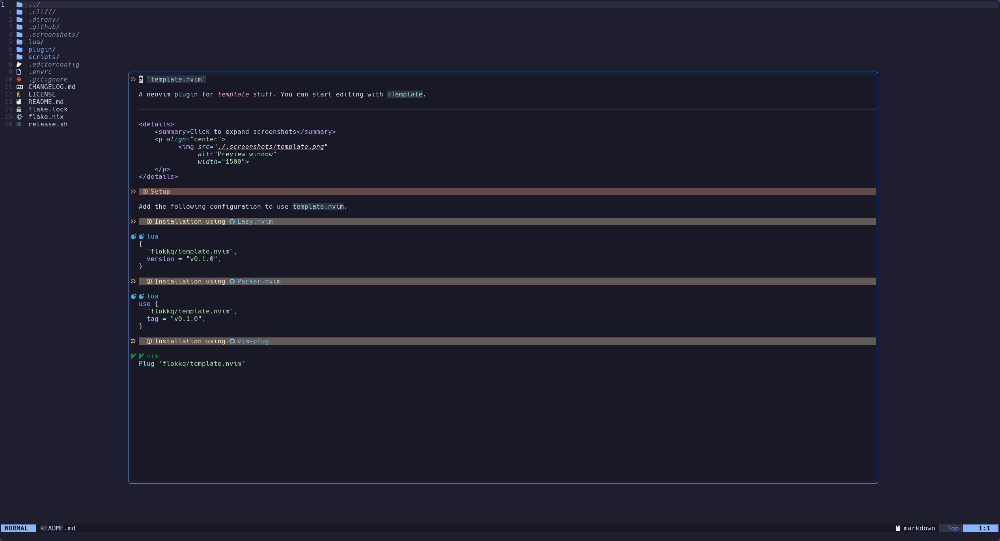

> [!Important]
> This is an actual template for neovim plugins. Replace all references of **<T/template>** and **\<your-gh-username>** with your plugins name. This template allows for seamless version and pacakge management.

---

# `template.nvim`

A neovim plugin for *template* stuff. You can start editing with `:Template`.

---

<details>
    <summary>Click to expand screenshots</summary>
    <p align="center">
          
    </p>
</details>

## Setup

Add the following configuration to use `template.nvim`.

### Installation using [Lazy.nvim](https://github.com/folke/lazy.nvim)

```lua
{
  "your-gh-username/template.nvim",
  version = "v0.1.0",
}
```

### Installation using [Packer.nvim](https://github.com/wbthomason/packer.nvim)

```lua
use {
  "your-gh-username/template.nvim",
  tag = "v0.1.0",
}
```

### Installation using [vim-plug](https://github.com/junegunn/vim-plug)

```vim
Plug 'your-gh-username/template.nvim'
```

